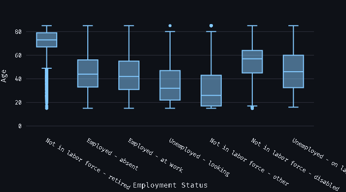
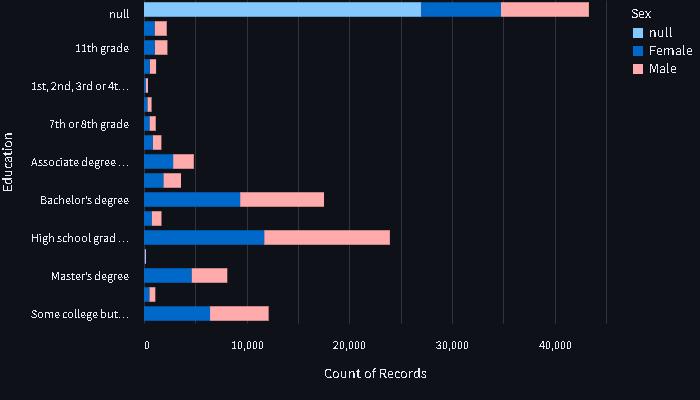
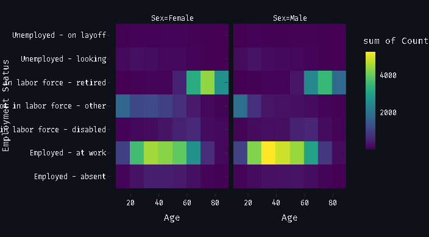

<div align=center>

# US Census CPS Data Visualization


[](https://streamlit.io/)
[](https://www.python.org/)
[](https://github.com/digitalherencia/CensusDataVisualizationDemo) 
[](https://www.gnu.org/licenses/gpl-3.0)
[](ftp://ftp.census.gov)
[](https://www.census.gov)
[](https://www.census.gov/programs-surveys/cps.html)

</div>

## Description

This project visualizes data from the Current Population Survey (CPS) using Streamlit, Altair, and Plotly. The visualizations provide insights into employment status, education level, and age distribution across different demographics in the United States.

## Project Structure

📦scripts  
┣ 📜app.py  
┣ 📜headers.py  
┗ 📜requirements.txt  
📦data  
┗ 📜2024_Basic_CPS_Public_Use_Record_Layout_plus_IO_Code_list.txt  

## Features

- **Age Distribution by Employment Status**


---

- **Education Level by Sex**
  

---

- **Employment Status by Age and Sex**


## Installation

1. **Clone the repository:**
    ```sh
    git clone https://github.com/digitalherencia/CensusDataVisualizationDemo.git
    cd CensusDataVisualizationDemo
    ```

2. **Set up the virtual environment:**
    ```sh
    python3 -m venv .venv
    source .venv/bin/activate  # On Windows use: .venv\Scripts\activate
    pip install -r scripts/requirements.txt
    ```

3. **Run the application:**
    ```sh
    streamlit run scripts/app.py
    ```

## Usage

The app fetches the latest CPS data, preprocesses it, and generates interactive visualizations. Open the app in your browser and explore the various charts and graphs to gain insights into the employment and education statistics.

## Visualizations

### 1. Age Distribution by Employment Status
This Plotly box plot shows the distribution of ages for different employment statuses. Hover over the boxes to see detailed statistics.

### 2. Education Level by Sex
This Altair chart shows the education level distribution by sex. Hover over the bars to see details.

### 3. Employment Status by Age and Sex (Heatmap)
This heatmap shows the density of different age groups within each employment status, split by sex.

## License

This project is licensed under the GPLv3.

## Contact

For any inquiries or feedback, please contact [digitalherencia@outlook.com](mailto:digitalherencia@outlook.com).
